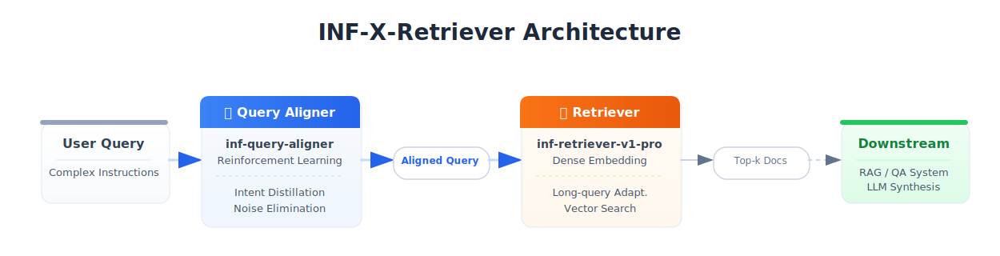

<h1 align="center">⚡ INF-X-Retriever</h1>

<p align="center">
  <strong>A Pragmatic & General Solution for Reasoning-Intensive Retrieval</strong>
</p>

<p align="center">
  <a href="https://brightbenchmark.github.io/"></a>
  <a href="https://huggingface.co/infly/inf-query-aligner"></a>
  <a href="https://huggingface.co/infly/inf-retriever-v1-pro"></a>
  <a href="https://opensource.org/licenses/Apache-2.0"></a>
</p>

## 📖 Overview

**INF-X-Retriever** is a production-grade dense retrieval framework designed to handle the complex, reasoning-intensive queries of the LLM era. Rooted in **engineering pragmatism**, it eschews complex multi-stage pipelines (like Rerankers or HyDE) in favor of a streamlined **Query Aligner + Dense Retriever** architecture. This "less is more" approach prioritizes low latency and robust cross-task transferability, currently holding the **No. 1 position** on the [BRIGHT Benchmark](https://brightbenchmark.github.io/) (as of Dec 17, 2025).

For a deep dive into our design philosophy and methodology, please refer to our [Documentation](docs/index.md).

---

## 🛠️ Architecture

Our system comprises two tightly integrated components:

1.  **🚀 Query Aligner** ([inf-query-aligner](https://huggingface.co/infly/inf-query-aligner)): Distills core retrieval intent from verbally complex queries using a Qwen2.5-7B-instruct foundation tuned via Reinforcement Learning.
2.  **🔍 Retriever** ([inf-retriever-v1-pro](https://huggingface.co/infly/inf-retriever-v1-pro)): A generalized dense retrieval model optimized for long-query adaptation and resistant to domain overfitting.

<p align="center">
  
</p>

---

## 🚀 Quick Start

Requirements: Python 3.10, Linux/macOS recommended.

### Installation

```bash
pip install -r requirements.txt
```

### 1. Query Rewriting (Optional)

To process raw parquet files and rewrite queries using the `inf-query-aligner`:

```bash
python rewrite_queries.py \
    --data_folder_path xlangai/bright \
    --model_name_or_path infly/inf-query-aligner \
    --output_path ./rewrite_data
```

### 2. Evaluation

To evaluate the model on supported tasks:

```bash
# Run the evaluation pipeline
./run.sh
```

**Configuration:**
You can customize the execution via environment variables:

```bash
MODEL_NAME="infly/inf-retriever-v1-pro" ENCODE_BATCH_SIZE=32 REWRITE_EVAL=false ./run.sh
```

---

## 🏆 Performance

**INF-X-Retriever** achieves state-of-the-art results on the [BRIGHT Benchmark](https://brightbenchmark.github.io/) (as of Dec 17, 2025).

The **BRIGHT** (Benchmark for Reasoning-Intensive Grounded HT) is a rigorous text retrieval benchmark designed to evaluate the capability of retrieval models in handling questions that require intensive reasoning and cross-document synthesis. Collected from real-world sources such as StackExchange, competitive programming platforms, and mathematical competitions, it comprises complex queries spanning diverse domains like mathematics, coding, biology, economics, and robotics.

**Why BRIGHT Matters:**
- **High Reasoning Complexity:** Unlike traditional keyword-centric benchmarks, BRIGHT queries often demand multi-step reasoning, evidence aggregation across documents, and theoretical mapping. This effectively exposes the limitations of standard models in complex "understanding + retrieval" tasks.
- **Authentic & Interdisciplinary:** By leveraging real-world data from varied professional fields, BRIGHT provides a faithful assessment of a model's generalization capabilities in specialized, high-stakes environments.
- **Critical for RAG:** As a stress test for modern Retrieval-Augmented Generation (RAG) systems, it serves as a key indicator for performance in demanding industrial applications such as scientific research, legal analysis, and medical Q&A.

### Overall & Category Performance

| Model | **Avg ALL** | **StackExchange** | **Coding** | **Theorem-based** |
|:---|:---:|:---:|:---:|:---:|
| **INF-X-Retriever** | **63.4** | **68.3** | **55.3** | **57.7** |
| DIVER (v3) | 46.8 | 51.8 | 39.9 | 39.7 |
| BGE-Reasoner-0928 | 46.4 | 52.0 | 35.3 | 40.7 |
| LATTICE | 42.1 | 51.6 | 26.9 | 30.0 |
| ReasonRank | 40.8 | 46.9 | 27.6 | 35.5 |
| XDR2 | 40.3 | 47.1 | 28.5 | 32.1 |

### Detailed Results Across 12 Datasets

| Model | Avg | Bio. | Earth. | Econ. | Psy. | Rob. | Stack. | Sus. | Leet. | Pony | AoPS | TheoQ. | TheoT. |
| :--- | :---: | :---: | :---: | :---: | :---: | :---: | :---: | :---: | :---: | :---: | :---: | :---: | :---: |
| **INF-X-Retriever** | **63.4** | **79.8** | **70.9** | **69.9** | **73.3** | **57.7** | **64.3** | **61.9** | **56.1** | **54.5** | **51.9** | **53.1** | **67.9** |
| DIVER (v3) | 46.8 | 66.0 | 63.7 | 42.4 | 55.0 | 40.6 | 44.7 | 50.4 | 32.5 | 47.3 | 17.2 | 46.4 | 55.6 |
| BGE-Reasoner-0928 | 46.4 | 68.5 | 66.4 | 40.6 | 53.1 | 43.2 | 44.1 | 47.8 | 29.0 | 41.6 | 17.2 | 46.5 | 58.4 |
| LATTICE | 42.1 | 64.4 | 62.4 | 45.4 | 57.4 | 47.6 | 37.6 | 46.4 | 19.9 | 34.0 | 12.0 | 30.1 | 47.8 |
| ReasonRank | 40.8 | 62.7 | 55.5 | 36.7 | 54.6 | 35.7 | 38.0 | 44.8 | 29.5 | 25.6 | 14.4 | 42.0 | 50.1 |
| XDR2 | 40.3 | 63.1 | 55.4 | 38.5 | 52.9 | 37.1 | 38.2 | 44.6 | 21.9 | 35.0 | 15.7 | 34.4 | 46.2 |

---

## 📥 Models

* **Aligner:** [🤗 inf-query-aligner](https://huggingface.co/infly/inf-query-aligner)
* **Retriever:** [🤗 inf-retriever-v1-pro](https://huggingface.co/infly/inf-retriever-v1-pro)

---

## 🖊️ Citation

```bibtex
@misc{inf-x-retriever-2025,
    title        = {INF-X-Retriever},
    author       = {Yichen Yao, Jiahe Wan, Yuxin Hong, Mengna Zhang, Junhan Yang, Zhouyu Jiang, Qing Xu, Yinghui Xu, Wei Chu, Yuan Qi},
    year         = {2025},
    url          = {https://yaoyichen.github.io/INF-X-Retriever},
    publisher    = {GitHub repository}
}
```

---

## 📬 Contact

Yichen Yao ([eason.yyc@inftech.ai](mailto:eason.yyc@inftech.ai))
