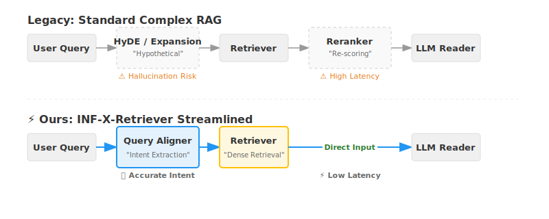

<h1 align="center">⚡ INF-X-Retriever</h1>

<p align="center">
  <strong>A Pragmatic & General Solution for Reasoning-Intensive Retrieval</strong>
</p>

<p align="center">
  <a href="https://brightbenchmark.github.io/"></a>
  <a href="https://huggingface.co/infly/inf-query-aligner"></a>
  <a href="https://huggingface.co/infly/inf-retriever-v1-pro"></a>
  <a href="https://opensource.org/licenses/Apache-2.0"></a>
</p>

<p align="center">
  <strong>INF-X-Retriever</strong> is a production-grade dense reasoning retrieval framework developed by <strong>Infinite Light Years (INF)</strong>.<br>
  It delivers robust retrieval performance across arbitrary task databases (<mathcal>X</mathcal>) with minimal supervision, emphasizing industrial deployability and reasoning depth over architectural complexity.
</p>

<p align="center">
  <a href="#-introduction">Introduction</a> •
  <a href="#-design-philosophy">Philosophy</a> •
  <a href="#-performance">Performance</a> •
  <a href="#-models">Models</a> •
  <a href="#-citation">Citation</a> •
  <a href="#-contact">Contact</a>
</p>

---

## 📖 Introduction

The advent of Large Language Models (LLMs) has fundamentally transformed information retrieval paradigms.

* **Pre-LLM Era:** Users issued concise, keyword-driven queries optimized for lexical matching.
* **LLM Era:** Users engage with retrieval systems as reasoning agents. Queries now encompass contextual narratives, explicit constraints, and structured formatting requirements—elements that constitute semantic noise for conventional retrieval architectures.

Addressing this evolution demands retrieval systems capable of sophisticated intent distillation from verbally complex inputs. **INF-X-Retriever** is purpose-built for this challenge. We validate our methodology on the **BRIGHT Benchmark**, a curated dataset reflecting real-world query complexity that necessitates reasoning-intensive document matching.

---

## 💡 Design Philosophy

Our methodology is rooted in **Engineering Pragmatism** and **First Principles Reasoning**. While competitive solutions on the BRIGHT leaderboard gravitate toward elaborate multi-stage architectures, we pursue a fundamentally different trajectory—one that prioritizes **production readiness**, **architectural coherence**, and **computational parsimony**. 

<p align="center">
  
</p>
> 🎯 **Core Principle:** *"Less is More"* — Maximal efficacy through deliberate minimalism.

### 🚫 No Rerankers

**Rationale:** *Architectural redundancy in RAG workflows*

Reranking stages introduce non-trivial latency and computational overhead while yielding diminishing returns. Given that downstream RAG systems invariably employ an LLM for answer synthesis, this component inherently performs context discrimination—rendering explicit reranking architecturally superfluous.


**Practical Considerations:** While adding a reranker module would likely yield measurable performance gains on the BRIGHT benchmark (which evaluates end-to-end retrieval accuracy), we deliberately eschew this component from a production deployment perspective. In real-world RAG applications, the downstream LLM already performs implicit ranking and filtering during answer synthesis—it naturally prioritizes relevant context and ignores irrelevant passages. An additional reranking stage introduces extra inference latency, operational complexity (model deployment, monitoring, and maintenance), and diminishing returns—the marginal accuracy improvement often does not justify the added system complexity.

Our solution focuses on achieving robust retrieval performance through a single-stage dense retrieval pipeline, prioritizing operational simplicity and inference efficiency over incremental benchmark gains.

### 🚫 No HyDE

**Rationale:** *Logical contradiction in the retrieval paradigm*

Hypothetical Document Embeddings (HyDE) is a retrieval technique that works as follows: given a user query, it first uses an LLM to generate a hypothetical "ideal answer" to that query, then retrieves documents that are semantically similar to this generated answer.

**The Core Problem:** This approach contains a fundamental logical contradiction:

- **Scenario A:** If the LLM already knows the correct answer (i.e., it has the domain knowledge needed to generate an accurate hypothetical answer), then why do we need retrieval at all? The LLM can answer directly—making the entire RAG pipeline redundant.

- **Scenario B:** If the LLM lacks the domain knowledge (which is precisely why we use RAG), then the "hypothetical answer" it generates is essentially a hallucination—a plausible-sounding but potentially incorrect response. Using this hallucinated answer to retrieve documents is like using a wrong map to navigate: you might find documents that seem relevant, but they may not actually contain the information needed to answer the original query correctly.

**Why It Fails in Practice:** While HyDE may perform well on benchmarks where test queries overlap with the LLM's training data (allowing it to generate reasonable hypothetical answers), it breaks down in real-world scenarios involving specialized domains, proprietary knowledge, or recent information—exactly the use cases where RAG systems are most valuable. In these scenarios, the LLM's hypothetical answers are unreliable, leading to retrieval failures that cascade through the entire system.

**Our Approach:** We perform direct query alignment—extracting the core retrieval intent from the user's query without generating hypothetical content. This ensures that retrieval is grounded in actual user needs rather than LLM-generated artifacts.

### ⚡ Radical Simplicity

**Rationale:** *Architectural complexity constitutes operational debt*

We systematically eschew conventional techniques that introduce deployment fragility:

- **No sparse retrieval** (e.g., BM25) — Eliminates hybrid fusion complexity and hyperparameter sensitivity
- **No multi-query expansion** — Single-pass alignment minimizes inference latency
- **No ensemble methods** — Monolithic robustness supersedes fragile model combinations

**Result:** A system that is **operationally streamlined**, **latency-optimized**, and **diagnostically transparent** in production deployments.

---

## 🛠️ Architecture


Our system comprises two tightly integrated components:

### 🚀 Query Aligner
* **Model:** [**🤗 inf-query-aligner**](https://huggingface.co/infly/inf-query-aligner)
* **Method:** Reinforcement Learning fine-tuning on [Qwen2.5-7B-instruct](https://huggingface.co/Qwen/Qwen2.5-7B-Instruct) foundation.
* **Function:** Performs semantic intent distillation from verbally complex queries. Executes pure **Query Alignment**—eliminating extraneous formatting directives and contextual noise to extract core retrieval intent—explicitly avoiding hypothetical document generation.

### 🔍 Retriever
* **Model:** [**🤗 inf-retriever-v1-pro**](https://huggingface.co/infly/inf-retriever-v1-pro)
* **Method:** Continual training on the general-purpose [inf-retriever-v1](https://huggingface.co/infly/inf-retriever-v1) backbone with targeted long-query adaptation.
* **Function:** A generalized dense retrieval architecture resistant to depth-specific overfitting, ensuring robust cross-task transferability.

<p align="center">
  
</p>
---

## 🏆 Performance

As of **November 20, 2025**, INF-X-Retriever holds the **No. 1 position** on the [BRIGHT Benchmark](https://brightbenchmark.github.io/).

### Overall & Category Performance

| Model | **Avg ALL** | **StackExchange** | **Coding** | **Theorem-based** |
|:---|:---:|:---:|:---:|:---:|
| **INF-X-Retriever** | **55.0** | **55.0** | **66.0** | **47.8** |
| BGE-Reasoner-0928 | 46.4 | 52.0 | 35.3 | 40.7 |
| DIVER (v2) | 45.8 | 52.2 | 35.3 | 38.7 |

### Detailed Results Across 12 Datasets

<table>
  <thead>
    <tr>
      <th rowspan="2">Model</th>
      <th rowspan="2">Avg</th>
      <th colspan="7" style="text-align:center; border-left: 2px solid #ccc;">StackExchange</th>
      <th colspan="2" style="text-align:center; border-left: 2px solid #ccc;">Coding</th>
      <th colspan="3" style="text-align:center; border-left: 2px solid #ccc;">Theorem-based</th>
    </tr>
    <tr>
      <th style="border-left: 2px solid #ccc;">Bio.</th>
      <th>Earth.</th>
      <th>Econ.</th>
      <th>Psy.</th>
      <th>Rob.</th>
      <th>Stack.</th>
      <th>Sus.</th>
      <th style="border-left: 2px solid #ccc;">Leet.</th>
      <th>Pony</th>
      <th style="border-left: 2px solid #ccc;">AoPS</th>
      <th>TheoQ.</th>
      <th>TheoT.</th>
    </tr>
  </thead>
  <tbody>
    <tr>
      <td><strong>INF-X-Retriever</strong></td>
      <td align="center"><strong>55.0</strong></td>
      <td align="center" style="border-left: 2px solid #ccc;"><strong>66.1</strong></td>
      <td align="center"><strong>62.8</strong></td>
      <td align="center"><strong>51.8</strong></td>
      <td align="center"><strong>61.1</strong></td>
      <td align="center">40.6</td>
      <td align="center"><strong>51.2</strong></td>
      <td align="center"><strong>51.8</strong></td>
      <td align="center" style="border-left: 2px solid #ccc;"><strong>45.4</strong></td>
      <td align="center"><strong>86.5</strong></td>
      <td align="center" style="border-left: 2px solid #ccc;"><strong>34.6</strong></td>
      <td align="center"><strong>49.4</strong></td>
      <td align="center"><strong>59.3</strong></td>
    </tr>
    <tr>
      <td>BGE-Reasoner-0928</td>
      <td align="center">46.4</td>
      <td align="center" style="border-left: 2px solid #ccc;">68.5</td>
      <td align="center">66.4</td>
      <td align="center">40.6</td>
      <td align="center">53.1</td>
      <td align="center"><strong>43.2</strong></td>
      <td align="center">44.1</td>
      <td align="center">47.8</td>
      <td align="center" style="border-left: 2px solid #ccc;">29.0</td>
      <td align="center">41.6</td>
      <td align="center" style="border-left: 2px solid #ccc;">17.2</td>
      <td align="center">46.5</td>
      <td align="center">58.3</td>
    </tr>
    <tr>
      <td>DIVER (v2)</td>
      <td align="center">45.8</td>
      <td align="center" style="border-left: 2px solid #ccc;">68.0</td>
      <td align="center">62.5</td>
      <td align="center">42.0</td>
      <td align="center">58.2</td>
      <td align="center">41.5</td>
      <td align="center">44.3</td>
      <td align="center">49.2</td>
      <td align="center" style="border-left: 2px solid #ccc;">34.8</td>
      <td align="center">32.9</td>
      <td align="center" style="border-left: 2px solid #ccc;">19.1</td>
      <td align="center">44.3</td>
      <td align="center">52.6</td>
    </tr>
  </tbody>
</table>

---

## 📥 Models

We have released both components as open-source artifacts to facilitate community research and development.

* **Aligner:** [🤗 inf-query-aligner](https://huggingface.co/infly/inf-query-aligner)
* **Retriever:** [🤗 inf-retriever-v1-pro](https://huggingface.co/infly/inf-retriever-v1-pro)

---

## 🖊️ Citation

If INF-X-Retriever contributes to your research or production systems, please cite our work:

```
@misc{inf-x-retriever-2025,
    title        = {INF-X-Retriever},
    author       = {Yichen Yao, Jiahe Wan, Yuxin Hong, Mengna Zhang, Zhouyu Jiang, Junhan Yang, Yinghui Xu, Wei Chu, Yuan Qi},
    year         = {2025},
    url          = {https://yaoyichen.github.io/INF-X-Retriever},
    publisher    = {GitHub repository}
}
```

---

## 📬 Contact

We welcome collaboration and inquiries from researchers and practitioners interested in reasoning-intensive retrieval.

**Project Lead:** Yichen Yao  
**Email:** [eason.yyc@inftech.ai](mailto:eason.yyc@inftech.ai)

For technical discussions, potential collaborations, or questions about deployment, please feel free to reach out.
