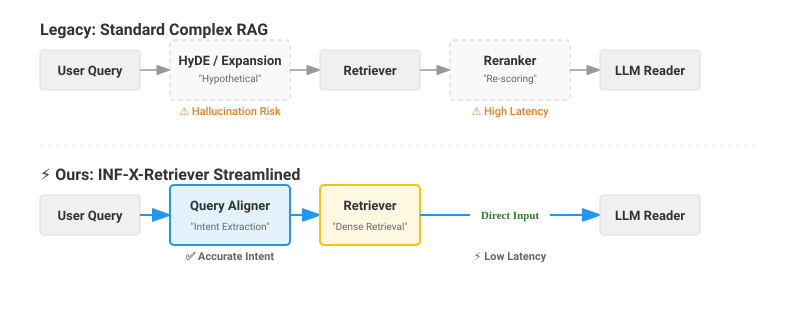
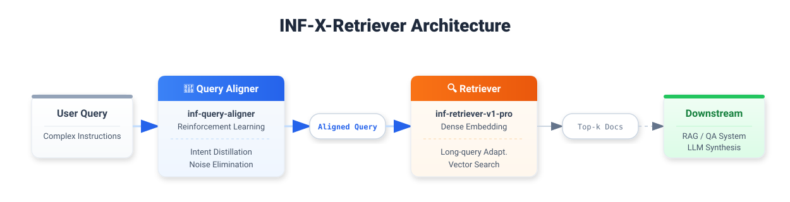

<h1 align="center">INF-X-Retriever</h1>

<p align="center">
  <strong>A Pragmatic, Production-Grade Framework for Reasoning-Intensive Retrieval</strong>
</p>

<p align="center">
  <a href="https://brightbenchmark.github.io/"></a>
  <a href="https://huggingface.co/infly/inf-query-aligner"></a>
  <a href="https://huggingface.co/infly/inf-retriever-v1-pro"></a>
  <a href="https://github.com/yaoyichen/INF-X-Retriever"></a>
  <a href="https://opensource.org/licenses/Apache-2.0"></a>
</p>

<p align="center">
  <strong>INF-X-Retriever</strong> is a high-performance dense retrieval framework developed by <strong><a href="https://inf.hk/">INF</a></strong>. <br>
  It provides a robust solution for complex reasoning-intensive tasks across a collection of tasks (X) with minimal supervision, prioritizing <strong>architectural simplicity, deployment reliability, and deep semantic alignment</strong>.
</p>

<p align="center">
  <a href="#-introduction">Introduction</a> •
  <a href="#-design-principles">Design Principles</a> •
  <a href="#-architecture">Architecture</a> •
  <a href="#-performance">Performance</a> •
  <a href="#-models">Models</a> •
  <a href="#-citation">Citation</a> •
  <a href="#-contact">Contact</a>
</p>

---

## 📖 Introduction

The evolution of Large Language Models (LLMs) has redefined information retrieval, shifting the paradigm from surface-level keyword matching to **intent-aware reasoning**. Modern queries in RAG (Retrieval-Augmented Generation) pipelines often contain intricate narrative contexts, logical constraints, and domain-specific directives—elements that act as "semantic noise" for conventional retrieval systems.

**INF-X-Retriever** addresses this challenge through **Intent Distillation**. By aligning complex queries into a unified semantic space and executing single-stage dense retrieval, it effectively penetrates surface-level complexity to reach core information. Our approach is evaluated on the **BRIGHT Benchmark**, a rigorous evaluation suite dedicated to reasoning-heavy retrieval scenarios. The new long-document result is **60.96 Recall@1**, self-reported and pending submission as of October 9, 2026; it is not an official rank claim.

---

## 💡 Design Principles

Our framework is guided by engineering practicality and first-principles reasoning. We intentionally avoid architectural bloat in favor of production readiness and computational efficiency.

<p align="center">
  
</p>

> 🎯 **Core Principle:** *"Less is More"* — Maximal efficacy through deliberate minimalism.

### ▫️ Single-Stage Retrieval (No Rerankers)
While reranking stages can marginally improve accuracy, they introduce significant latency and operational overhead. In modern RAG pipelines, downstream LLMs already perform implicit context discrimination during synthesis. We demonstrate that a **high-fidelity single-stage retriever** provides the optimal balance of precision and throughput, significantly simplifying deployment and monitoring in production environments.

### ▫️ Direct Query Alignment (No HyDE)
Hypothetical Document Embeddings (HyDE) rely on LLMs to generate "pseudo-answers" to guide retrieval. This introduces two critical failure modes:
1. **Redundancy**: If the LLM already knows the answer, retrieval is redundant.
2. **Hallucination Drift**: When the LLM lacks domain knowledge (the primary use case for RAG), hypothetical answers can steer the retriever toward misleading content.
INF-X-Retriever performs **Direct Intent Extraction**, ensuring retrieval remains grounded in the actual user requirements and source evidence.

### ▫️ Operational Simplicity
We eliminate components that introduce fragility or hyperparameter sensitivity:
- **No Sparse Retrieval (BM25)**: Removes the complexity of hybrid fusion and weight tuning.
- **No Multi-Query Expansion**: Single-pass alignment minimizes tail latency.
- **No Model Ensembles**: Ensures a transparent, maintainable, and diagnostic-friendly pipeline.

---

## 🛠️ Architecture

The framework consists of two tightly integrated, purpose-built components:

### 1. Query Aligner
* **Model**: <a href="https://huggingface.co/infly/inf-query-aligner"><strong>🤗 inf-query-aligner</strong></a>
* **Backbone**: Qwen2.5-7B-Instruct (Fine-tuned via Reinforcement Learning)
* **Function**: Distills core retrieval intent from verbally complex or noisy queries. It ensures the query embedding is focused on the underlying task rather than linguistic artifacts.

### 2. Retriever
* **Model**: <a href="https://huggingface.co/infly/inf-retriever-v1-pro"><strong>🤗 inf-retriever-v1-pro</strong></a>
* **Backbone**: Continual training on `inf-retriever-v1` with targeted long-query adaptation.
* **Function**: A generalized dense retrieval architecture optimized for cross-task transfer, stability, and high-dimensional semantic mapping.

<p align="center">
  
</p>

---

## 📊 Performance

The short-document tables below are a **historical December 20, 2025 snapshot**, not a current ranking. The long-document section adds the **October 9, 2026 locally validated Chunk-Max result**, pending official submission and acceptance.

**BRIGHT** is a rigorous text retrieval benchmark designed to evaluate the capability of retrieval models in handling questions that require intensive reasoning and cross-document synthesis. Collected from real-world sources such as StackExchange, competitive programming platforms, and mathematical competitions, it comprises complex queries spanning diverse domains like mathematics, coding, biology, economics, and robotics.

**Why BRIGHT Matters:**
- **High Reasoning Complexity:** Unlike traditional keyword-centric benchmarks, BRIGHT queries often demand multi-step reasoning, evidence aggregation across documents, and theoretical mapping. This effectively exposes the limitations of standard models in complex "understanding + retrieval" tasks.
- **Authentic & Interdisciplinary:** By leveraging real-world data from varied professional fields, BRIGHT provides a faithful assessment of a model's generalization capabilities in specialized, high-stakes environments.
- **Critical for RAG:** As a stress test for modern Retrieval-Augmented Generation (RAG) systems, it serves as a key indicator for performance in demanding industrial applications such as scientific research, legal analysis, and medical Q&A.

### Short document

#### Overall & Category Performance

| Model | **Avg ALL** | **StackExchange** | **Coding** | **Theorem-based** |
|:---|:---:|:---:|:---:|:---:|
| **INF-X-Retriever** | **63.4** | **68.3** | **55.3** | **57.7** |
| DIVER (v3) | 46.8 | 51.8 | 39.9 | 39.7 |
| BGE-Reasoner-0928 | 46.4 | 52.0 | 35.3 | 40.7 |
| LATTICE | 42.1 | 51.6 | 26.9 | 30.0 |
| ReasonRank | 40.8 | 46.9 | 27.6 | 35.5 |
| XDR2 | 40.3 | 47.1 | 28.5 | 32.1 |

#### Detailed Results Across 12 Datasets

| Model | Avg | Bio. | Earth. | Econ. | Psy. | Rob. | Stack. | Sus. | Leet. | Pony | AoPS | TheoQ. | TheoT. |
| :--- | :---: | :---: | :---: | :---: | :---: | :---: | :---: | :---: | :---: | :---: | :---: | :---: | :---: |
| **INF-X-Retriever** | **63.4** | **79.8** | **70.9** | **69.9** | **73.3** | **57.7** | **64.3** | **61.9** | **56.1** | **54.5** | **51.9** | **53.1** | **67.9** |
| DIVER (v3) | 46.8 | 66.0 | 63.7 | 42.4 | 55.0 | 40.6 | 44.7 | 50.4 | 32.5 | 47.3 | 17.2 | 46.4 | 55.6 |
| BGE-Reasoner-0928 | 46.4 | 68.5 | 66.4 | 40.6 | 53.1 | 43.2 | 44.1 | 47.8 | 29.0 | 41.6 | 17.2 | 46.5 | 58.4 |
| LATTICE | 42.1 | 64.4 | 62.4 | 45.4 | 57.4 | 47.6 | 37.6 | 46.4 | 19.9 | 34.0 | 12.0 | 30.1 | 47.8 |
| ReasonRank | 40.8 | 62.7 | 55.5 | 36.7 | 54.6 | 35.7 | 38.0 | 44.8 | 29.5 | 25.6 | 14.4 | 42.0 | 50.1 |
| XDR2 | 40.3 | 63.1 | 55.4 | 38.5 | 52.9 | 37.1 | 38.2 | 44.6 | 21.9 | 35.0 | 15.7 | 34.4 | 46.2 |

### Long document

**Metric:** macro-average document-level Recall@1 × 100 across all eight tasks.
**Update (October 9, 2026):** the frozen Chunk-Max score files were independently
re-evaluated against the official `gold_ids_long`: **60.9635 → 60.96**.
All **861 queries** are covered; document IDs and per-query exclusions pass validation.
This is a **self-reported result, not yet submitted or accepted by the leaderboard**.
The previously published 54.6 result is retained for comparison.

**Reproducibility:** [Method](https://github.com/yaoyichen/INF-X-Retriever/blob/5575f6c376bb0aa0bb304578ae11c8e8b6f7529f/docs/bright-long-chunkmax.md) · [Download all eight score files (ZIP)](https://raw.githubusercontent.com/yaoyichen/INF-X-Retriever/54af35d78d244bbd05863349c65e9ac102557cc9/results/bright-long-chunkmax/bright-long-chunkmax-20261009.zip) · [Validation report](https://github.com/yaoyichen/INF-X-Retriever/blob/54af35d78d244bbd05863349c65e9ac102557cc9/results/bright-long-chunkmax/validation.json) · [SHA-256](https://github.com/yaoyichen/INF-X-Retriever/blob/54af35d78d244bbd05863349c65e9ac102557cc9/results/bright-long-chunkmax/SHA256SUMS)


#### Detailed Results Across 8 Datasets

| Model | Avg | Bio. | Earth. | Econ. | Pony | Psy. | Rob. | Stack. | Sus. |
| :--- | :---: | :---: | :---: | :---: | :---: | :---: | :---: | :---: | :---: |
| **INF-X-Retriever + Chunk-Max (self-reported; pending submission)** | **60.96** | **76.13** | **60.99** | **73.14** | **11.78** | **81.22** | **57.92** | **53.42** | **73.10** |
| INF-X-Retriever (previously published, truncation) | **54.6** | **73.2** | **59.6** | **69.3** | **12.1** | **74.3** | **55.9** | **27.8** | **64.8** |
| inf-retriever-v1-pro | 30.5 | 44.1 | 42.2 | 31.4 | 0.4 | 43.1 | 20.8 | 21.4 | 41.0 |

#### Long-document method: Chunk-Max (no reranker, no Wiki)

Reuse the released query-aligner rewrites, split each document into contiguous
**20,000-character chunks**, embed each chunk with an **8,192-token cap**, and use
its maximum query–chunk cosine similarity as the original document's score.
Return only original document IDs after applying `excluded_ids`.
Character chunks are not guaranteed to fit the token cap; tokenization can still
truncate individual chunks. No new training or query expansion is introduced.

#### Quick start: run the Chunk-Max configuration

From the repository root, after installing `requirements.txt`:

```bash
MODEL_NAME=inf REWRITE_EVAL=true \
LONG_CONTEXT=true CHUNK_CHARS=20000 \
DOC_MAX_LENGTH=8192 QUERY_MAX_LENGTH=8192 ENCODE_BATCH_SIZE=1 \
OUTPUT_DIR=./output/INF-X-Retriever-chunkmax ./run.sh
```

This runs the eight long-document tasks and writes to a separate output
directory. A GPU is required for local-model inference. `LONG_CONTEXT=true`
alone uses legacy truncation, **not** Chunk-Max.

The validated result was produced by the internal `inf-retriever-v1-pro` serving
configuration; the public local-model runner now supports the same chunk-max
algorithm, but has **not** been rerun end to end to establish score parity.
The separate experimental Wiki variant scored 61.07 (+0.11 points), but is not
part of this primary submission or the public runner.

See [method, validation, and reproduction](https://github.com/yaoyichen/INF-X-Retriever/blob/5575f6c376bb0aa0bb304578ae11c8e8b6f7529f/docs/bright-long-chunkmax.md) for the frozen dataset
revision, score checksums, inference differences, and commands.


Notes:
- Results reflect end-to-end retrieval accuracy on BRIGHT under the official evaluation protocol.
- Performance may vary with hardware, index size, and dataset versions.

---

## 🧪 Models

Both models are released under the **Apache-2.0 License** for both research and commercial application.

| Component | Hugging Face Repository | Description |
| :--- | :--- | :--- |
| **Query Aligner** | [`inf-query-aligner`](https://huggingface.co/infly/inf-query-aligner) | LLM-based intent distiller. |
| **Retriever** | [`inf-retriever-v1-pro`](https://huggingface.co/infly/inf-retriever-v1-pro) | Advanced dense embedding model. |

---

## 📝 Citation

If you utilize INF-X-Retriever in your research or production systems, please cite our work:

```text
@misc{inf-x-retriever-2025,
    title        = {INF-X-Retriever: A Pragmatic Framework for Reasoning-Intensive Dense Retrieval},
    author       = {Yichen Yao, Jiahe Wan, Yuxin Hong, Mengna Zhang, Junhan Yang, Zhouyu Jiang, Yinghua Hong, Qing Xu, Kuan Lu, Yinghui Xu, Wei Chu, Emma Wang, Yuan Qi},
    year         = {2025},
    url          = {[https://github.com/yaoyichen/INF-X-Retriever](https://github.com/yaoyichen/INF-X-Retriever)},
    publisher    = {GitHub repository}
}
```

---

## 📬 Contact

We welcome inquiries regarding technical deep-dives, strategic collaborations, or large-scale deployment support. Our team is committed to advancing the boundaries of reasoning-intensive retrieval.

* **Contact**: [eason.yyc@inftech.ai](mailto:eason.yyc@inftech.ai)
* **Organization**: [INF](https://inf.hk/)
* **Issue Tracking**: For bug reports or feature requests, please use the [GitHub Issues](https://github.com/yaoyichen/INF-X-Retriever/issues) portal.

<p align="center">
  <br>
  <strong>Built with precision by the INF Team.</strong>
</p>
